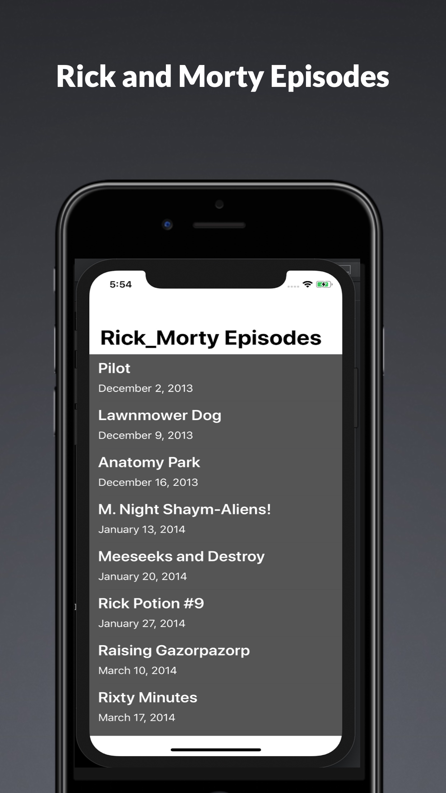
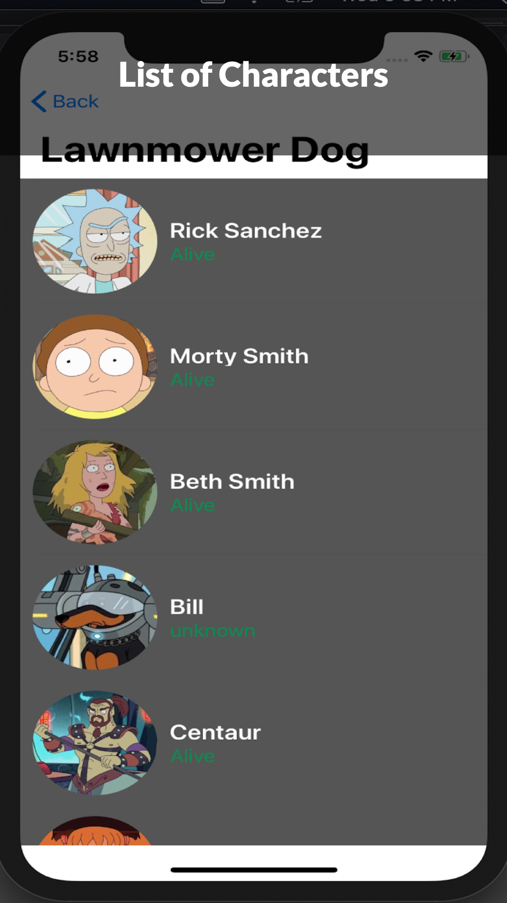
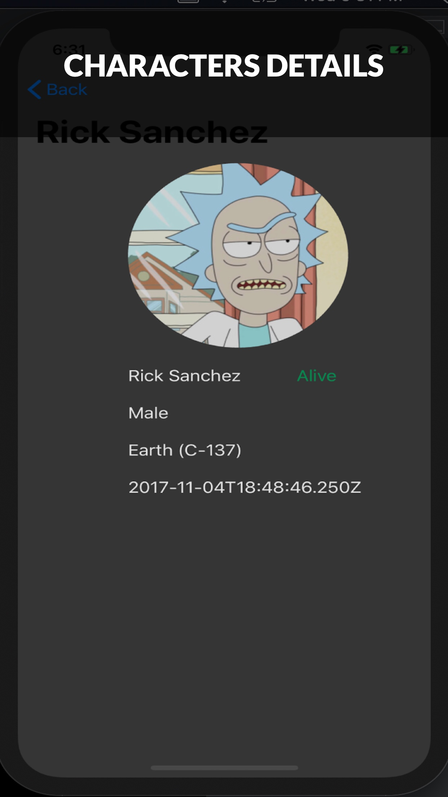

# Coordinator_Pattern
In this simple project, I have used coordination pattern technique to handle navigation. I also used NSOperationQueue and NsOperations to asynchronously fetch images from remote API and rendered them in tableView cell
To achieve this, I use simple Rick & Morty API (https://rickandmortyapi.com/)
## Enjoying the animated gif down here ##

